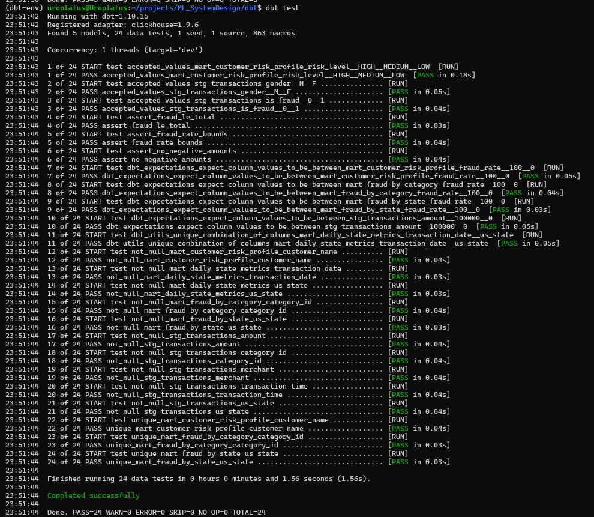
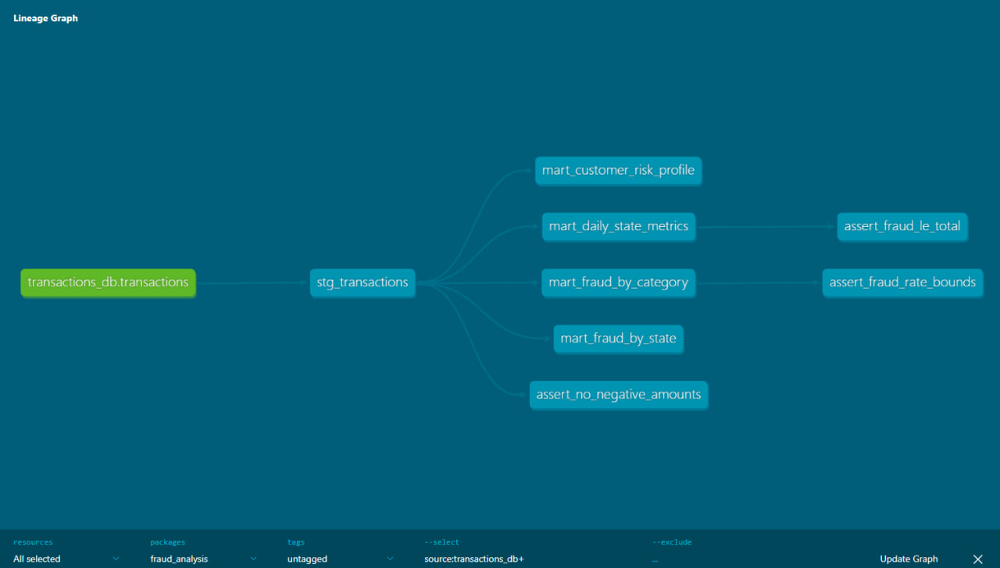

# dbt project with Fraud transactions data
Датасеты предоставлены в рамках соревнования https://www.kaggle.com/competitions/teta-ml-1-2025

---
## ✏️ Структура проекта

```
dbt/
├── dbt_project.yml
├── packages.yml
├── profiles.yml
├── models/
│   ├── sources/
│   │   └── sources.yml
│   ├── staging/
│   │   ├── stg_transactions.sql
│   │   └── stg_transactions.yml
│   └── marts/
│       ├── mart_daily_state_metrics.sql
│       ├── mart_fraud_by_category.sql
│       ├── mart_fraud_by_state.sql
│       ├── mart_customer_risk_profile.sql
│       └── schema.yml
├── macros/
│   └── amount_bucket.sql
├── tests/
│   ├── assert_no_negative_amounts.sql
│   ├── assert_fraud_le_total.sql
│   └── assert_fraud_rate_bounds.sql
└── seeds/
    └── states.csv

```

---

---

## Схема данных (source)

Таблица `transactions_db.transactions`:

| Колонка | Тип | Описание |
|---------|-----|----------|
| transaction_time | DateTime | Время транзакции |
| merch | String | Мерчант |
| cat_id | String | Категория (14 значений) |
| amount | Float64 | Сумма |
| name_1, name_2 | String | Имя, фамилия клиента |
| gender | String | Пол (M/F) |
| us_state | String | Штат США (50 штатов) |
| lat, lon | Float64 | Координаты клиента |
| merchant_lat, merchant_lon | Float64 | Координаты мерчанта |
| target | UInt8 | Признак фрода (0/1) |

---

## 🚀Команды для запуска

```bash
cd dbt/

# Установка зависимостей
dbt deps

# Загрузка seeds
dbt seed

# Запуск моделей
dbt run

# Запуск тестов
dbt test

# Генерация документации
dbt docs generate && dbt docs serve

# Полный цикл
dbt deps && dbt seed && dbt run && dbt test
```



